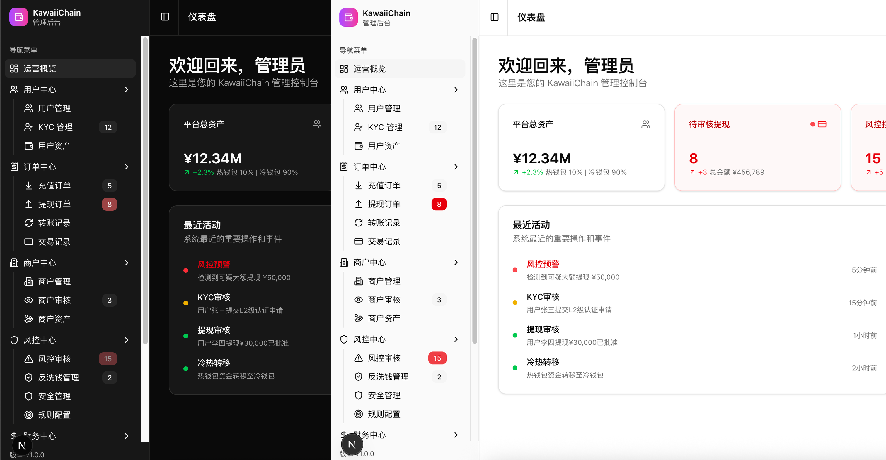

# 🛠 KawaiiChain Admin

> 强大的运营管理后台，让钱包运营更高效

## 📸 界面预览



## ✨ 核心特性

- **📊 数据监控** - 实时查看用户数据、交易统计和系统运行状态
- **👥 用户管理** - 用户信息查询、KYC审核、账户状态管理
- **💼 商户管理** - 商户入驻审核、交易监控、结算管理
- **🔐 权限控制** - 灵活的角色权限体系，保障运营安全
- **📈 报表分析** - 多维度数据报表，辅助运营决策

## 🎯 功能模块

### 已实现
- ✅ 用户管理系统
- ✅ 数据统计看板
- ✅ 权限角色管理
- ✅ 系统配置管理

### 开发中
- 🚧 商户管理系统
- 🚧 交易监控预警
- 🚧 财务结算管理
- 🚧 运营数据分析

## 🚀 快速开始

```bash
# 安装依赖
pnpm install

# 启动开发服务器
pnpm dev

# 构建生产版本
pnpm build
```

## 🛠 技术栈

- Next.js 15 - React框架
- TypeScript - 类型安全
- Tailwind CSS - 样式方案
- shadcn/ui - 组件库

## 🤝 参与贡献

我们欢迎所有形式的贡献！无论是报告Bug、提出新功能建议、改进文档还是提交代码。

---

**Built with 💖 by KawaiiChain Team**
